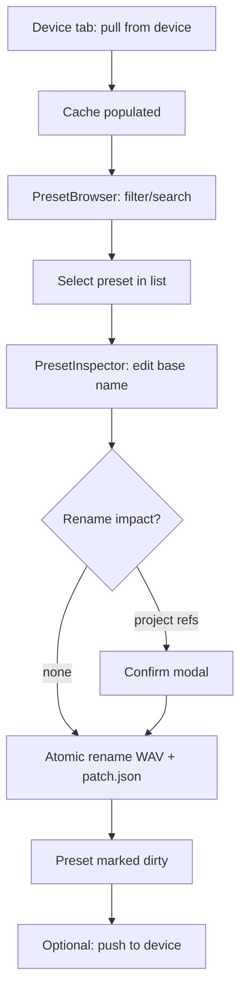
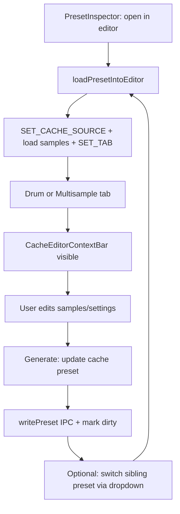
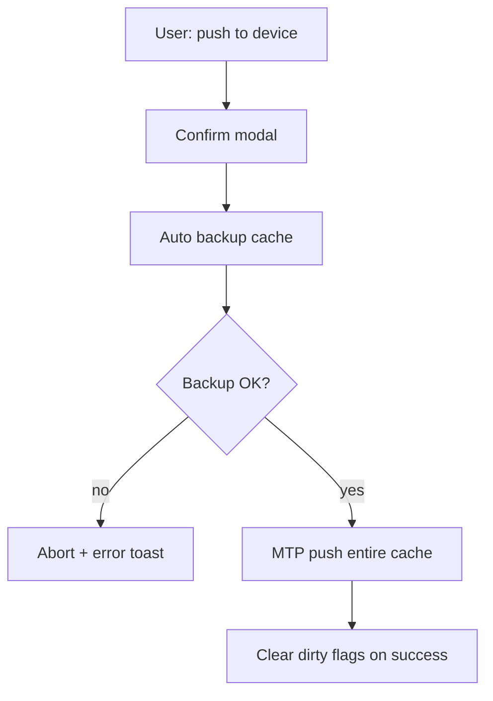
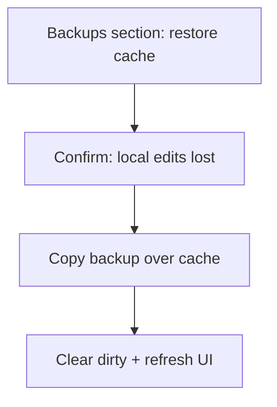

# OP-XY MTP Manager — UI, UX & Functionality Audit

**Document purpose:** Persistent, code-derived inventory of everything the app presents to the user, how it behaves, and how the pieces connect. Use this for UX reassessment — not as a design spec.

**Last audited against codebase:** 2026-06-06  
**App version:** 0.1.0 (fork of OP-PatchStudio)  
**Platform:** Electron desktop (Windows MTP primary); renderer also runs in browser with degraded functionality.

**Related docs:** [structure.md](./structure.md) (device file formats), [design-direction.md](./design-direction.md) (target UX — supersedes this app's navigation model), [README](../README.md) (dev setup).

---

## Table of contents

1. [Product intent](#1-product-intent)
2. [Application shell](#2-application-shell)
3. [Global architecture](#3-global-architecture)
4. [Tab: device](#4-tab-device)
5. [Tab: drum](#5-tab-drum)
6. [Tab: multisample](#6-tab-multisample)
7. [Cross-tab flows](#7-cross-tab-flows)
8. [Backend & data layer (UI-facing)](#8-backend--data-layer-ui-facing)
9. [Notifications, modals & feedback](#9-notifications-modals--feedback)
10. [Dual runtime: Electron vs browser](#10-dual-runtime-electron-vs-browser)
11. [Inherited PatchStudio surface](#11-inherited-patchstudio-surface)
12. [Known gaps & limitations](#12-known-gaps--limitations)
13. [UX friction inventory (for reassessment)](#13-ux-friction-inventory-for-reassessment)
14. [Component map](#14-component-map)

---

## 1. Product intent

### What the app is for

| Goal | Supported today |
|------|-----------------|
| Pull OP-XY `presets/`, `samples/`, `projects/` over USB MTP into a local cache | Yes |
| Browse ~275+ sample-based presets with filters | Yes |
| Rename samples inside presets (atomic: WAV + `patch.json`) | Yes |
| Rename standalone `samples/user/` files | Yes |
| Preview audio from cache | Yes |
| Open drum/sampler presets in full editors | Yes |
| Edit samples (trim, settings, engine params) and write back to cache | Yes |
| Push cache changes back to device | Yes (full cache overwrite) |
| Local dated backups + restore | Yes |
| Warn when renames may break `.xy` project references | Yes (warn only) |
| Browse project files and see indexed sample refs | Yes (read-only) |
| Patch `.xy` project binaries on rename | No |
| Edit synth-engine presets (axis, prism, …) | No (catalog only via list) |
| Side-by-side preset comparison | No |
| Push diff / selective sync | No |

### Mental model (intended)

```
Device (MTP)  ←pull/push→  Local cache  ←read/write→  In-memory editors (drum / multisample tabs)
                                ↓
                         Project index (rename safety)
```

The **device tab** is the librarian. The **drum** and **multisample** tabs are creation/edit tools inherited from OP-PatchStudio, extended with a **cache link** when a preset was opened from device cache.

---

## 2. Application shell

### Layout hierarchy

```
┌─────────────────────────────────────────────────────────┐
│ AppHeader — title + subtitle                            │
├─────────────────────────────────────────────────────────┤
│ TabNavigation — [device] [drum] [multisample]           │
├─────────────────────────────────────────────────────────┤
│ Active tab panel (rounded card, min-height 500px)         │
│   … tab content …                                       │
├─────────────────────────────────────────────────────────┤
│ NotificationSystem (toast stack, top-right)               │
└─────────────────────────────────────────────────────────┘
```

- **Max content width:** 1100px centered (`App.tsx`).
- **Theme:** Carbon `Theme theme="white"` + custom SCSS (`device-themes.scss`).
- **Typography:** Header uses NimbusSansL; tab content uses Montserrat (drum/multisample tools).
- **Footer component exists** (`Footer.tsx`) but is **not mounted** in `App.tsx` — upstream PatchStudio attribution is unused in the shell.

### Navigation tabs

| Tab ID | Label | Role |
|--------|-------|------|
| `device` | device | MTP connection, cache browse, rename, backups |
| `drum` | drum | 24-pad drum kit editor |
| `multisample` | multisample | Zone-based sampler editor |

- Tab state lives in `AppContext.currentTab`.
- No URL routing; tab switches are in-memory only.
- No tab badges (e.g. dirty count, connection status on tabs).

---

## 3. Global architecture

### Central state (`AppContext`)

Single React reducer holds:

| Domain | Key fields |
|--------|------------|
| Navigation | `currentTab` |
| Drum editor | `drumSamples[24]`, `drumSettings`, `importedDrumPreset` |
| Multisample editor | `multisampleFiles[]`, `multisampleSettings`, `selectedMultisample`, `importedMultisamplePreset` |
| Device cache link | `cacheSource: { relativePath, name, category, type } \| null` |
| UI chrome | `isLoading`, `error`, keyboard pin flags, `notifications[]` |
| Conventions | `midiNoteMapping: 'C3' \| 'C4'` |

**`cacheSource`** is set when opening a preset from device cache into an editor. It enables:
- Context bar on drum/multisample tabs
- Save-back to same preset path (`update cache preset` vs `save to cache`)
- Preset switcher within category

Clearing `cacheSource` (`clear link`) does **not** unload editor samples.

### IPC bridge (`window.opxy.device`)

Only available in Electron (via preload). All device-tab operations and cache read/write go through this API. See [§8](#8-backend--data-layer-ui-facing).

### Persistence outside React state

| What | Where |
|------|-------|
| Device cache | `%AppData%/opxy-mtp-manager/device-cache/` |
| Dated backups | `Documents/OP-XY Backups/` |
| ZIP exports (non-cache fallback) | `Documents/OP-XY Exports/` |
| Default drum/multisample settings | `localStore` |
| MIDI channel, keyboard pin | `localStorage` / `localStore` |
| Dirty preset list | In-memory in main process (`cacheSession.ts`) — lost on app restart |

---

## 4. Tab: device

**Component:** `DevicePage.tsx`  
**Layout:** Single vertical scroll; sections separated by lowercase `h3` headers with bottom border.

### 4.1 Section: device connection

**UI elements:**
- Status tag: green `connected` / gray `not connected`
- Device name (when connected)
- Counts: `N presets · M samples` (when cache has content)
- Red tag: `K modified` (dirty presets count)
- Help text when disconnected: "Connect OP-XY via USB, unlock, then refresh."
- Error display when bridge/MTP fails

**Actions:**

| Button | Enabled when | Behavior |
|--------|--------------|----------|
| pull from device | connected, not busy | MTP copy → cache; clears dirty flags; rebuilds project index; toast |
| backup cache | cache has content | Copy cache → Documents backup folder |
| push to device | connected + cache ready | Confirm modal → auto backup → MTP push entire cache → clear dirty |
| refresh | not busy | Re-fetch status, lists, backups, project index |

**Inline loading:** "Working…" during any async operation (`busy` flag shared across page).

**Projects note (small text):** One line under buttons, e.g. `Projects: 12 projects · 340 sample names indexed`.

### 4.2 Section: backups (conditional)

Shown only when `backups.length > 0`. Lists **up to 5** most recent backups.

Each row:
- Timestamp, preset/sample counts
- `show folder` — opens backup in Explorer
- `restore cache` — confirm modal → replaces live cache, clears dirty flags

### 4.3 Section: presets

**Empty state:** "Pull from device to browse presets."

**Component:** `PresetBrowser` — side-by-side master/detail layout.

#### Filter bar
- Search (name, category, type)
- Toggle: `unnamed` — presets with unnamed samples
- Toggle: `modified` — presets in dirty list
- Type chips: `all` | `drum` | `sampler`
- Category tags (click to filter; multi-select; `all` clears)
- `collapse all` / `expand all`
- Counter: `showing X of Y`

**Category collapse rules:**
- Categories with >8 presets start collapsed
- Selected preset's category stays expanded

#### Preset list (left ~36%)
- Grouped by category with collapsible headers
- Each row: name, type, unnamed count, modified marker
- Selected row: left blue border + highlight

#### Preset inspector (right ~64%, sticky)
**Component:** `PresetInspector`

**Header:**
- Name, tags (modified, unnamed count)
- Meta: `category · type · N regions`
- Prev/next arrows (within **filtered** list, not category-only)
- Position label: `3 / 42`
- `open in drum|multisample editor` (sample-based types only)
- `close` — deselects preset

**Bulk rename block** (when unnamed regions exist):
- Text input: base name (defaults to preset name)
- `bulk rename unnamed` — renames all unnamed regions sequentially (no per-project confirm in bulk path)

**Per-region rows:**
- Parsed filename tags: base (magenta if unnamed), note, idx
- Drum pad label / MIDI range / root pitch / missing audio warning
- Text input: sample base name
- `rename` — atomic rename; may show project-ref confirm modal
- `preview` / `hide preview` — inline `CacheAudioPreview`

**Synth-engine presets:** Appear in list if they have empty regions filter… Actually `sampleBased` filter hides them from PresetBrowser (`samplePresets` filter). Non-sample presets are **not shown** in browser.

### 4.4 Section: projects

**Component:** `ProjectsBrowser`

**Empty state:** Explains pull copies `projects/` for rename safety.

**When populated:**
- Summary line: file count, indexed unique names, total refs
- Search, toggle `with sample refs only`
- List (cap **100** visible): project name, path, sample-ref tag
- Expand row → tag list of referenced filenames

**Not supported:** Open project in editor, edit project, jump from sample ref to preset, patch project on rename.

### 4.5 Section: standalone samples

**Filters:** search, `unnamed only` toggle

**List (cap 100):** Each tile:
- Filename, unnamed tag
- Parsed base · note · idx
- Base name input + `rename` + `preview`

Rename may trigger project-ref confirmation modal.

---

## 5. Tab: drum

**Component:** `DrumTool.tsx`  
**Vertical stack** of card sections. Mobile breakpoint: `<768px` adjusts padding.

### 5.0 Cache editor context bar (conditional)

**Component:** `CacheEditorContextBar` — only when `cacheSource !== null`.

**Row 1:** `from device cache: {name} ({category} · {type})` | `back to device` | `clear link`

**Row 2 (drum/sampler types):**
- Category position: `drum · 3/42`
- Prev / dropdown (all siblings in category, fallback all same-type) / next
- Loading states during preset list fetch or switch

Switching presets **reloads entire editor state** from cache (samples + patch settings).

### 5.1 Section: load and play samples

**Component:** `DrumKeyboardContainer` → `DrumKeyboard`

**Header controls:**
- Loaded count: `N / 24 loaded`
- `organize` — toggles organize mode (reorders table/keyboard layout)
- `midi` — toggle MIDI device selector
- Pin icon — sticky keyboard while scrolling

**Keyboard:**
- 24 pads in two rows; labels KD1, SD1, … GUI
- Computer keyboard mapping (A/W/S/E/…)
- Click pad: play sample / drop file on pad
- Web MIDI input (channel selectable 1–16, persisted)
- Organize mode: drag samples between pads

### 5.2 Section: sample management

**Component:** `DrumSampleTable`

**Table columns (desktop):**
| Column | Content |
|--------|---------|
| drum key | Pad name; drag handle in organize mode |
| file details | Filename, `FileDetailsBadges` (size, duration, format) |
| waveform | `SmallWaveform`; zoom opens `WaveformZoomModal` |
| actions | Play, delete, record, settings (gear → `DrumSampleSettingsModal`) |

**Per-sample settings modal:** playmode, reverse, transpose, pan, gain, trim points.

**Footer actions:**
- `clear all` — confirm
- `record` — `RecordingModal` (max 20s)
- `browse` — multi-file picker for unassigned samples
- Hidden: OP-1 drum preset import (`.aif`), unassigned sample import

**Bulk edit:** `DrumBulkEditModal` (trigger elsewhere in table toolbar area)

### 5.3 Section: preset settings

**Component:** `DrumPresetSettings`

Engine-level controls: playmode, transpose, velocity sensitivity, volume, stereo width.

Merged with imported `patch.json` engine block on export.

### 5.4 Section: audio processing

**Component:** `AudioProcessingSection` (type=`drum`)

- Sample rate, bit depth, channels (0 = keep original)
- Normalize toggle + level
- Auto zero-crossing (apply to all)
- Reset to defaults (confirm)

Applied at export/cache-write time, not destructively in preview.

### 5.5 Section: generate preset

**Component:** `GeneratePresetSection` (type=`drum`)

| Element | Electron behavior | Browser behavior |
|---------|-------------------|------------------|
| Preset name input | Yes | Yes |
| Rename files / separator / WAV-AIFF toggles | **Hidden** | Shown |
| Patch size indicator | Yes | Yes |
| Summary checklist | Yes | Yes |
| Primary CTA | `update cache preset` or `save to cache` | `download preset` (.preset.zip) |
| Secondary | reset all, save as default | Same |

**Generate requirements:** ≥1 loaded sample + non-empty preset name.

**Cache write:** Uses device filename pattern `{base}-{note}-{idx}.wav`; marks preset dirty.

---

## 6. Tab: multisample

**Component:** `MultisampleTool.tsx`  
Same overall card-stack pattern as drum tab.

### 6.0 Cache editor context bar

Identical to drum tab (§5.0).

### 6.1 Section: load and play samples

**Components:** `VirtualMidiKeyboard` (pin/sticky/MIDI), sample load area

- Virtual piano keyboard for auditioning zones
- Zone map computed from root notes (each sample covers down to previous root; top sample extends to 127)
- Web MIDI + channel selector
- Pin behavior mirrors drum keyboard

### 6.2 Section: sample management

**Component:** `MultisampleSampleTable`

- Rows per loaded sample: root note, file details, waveform, actions
- Drag-reorder changes zone order
- Footer: clear all, record, browse

No per-sample settings modal (unlike drum). `editedSamplesCount` hardcoded to 0 in generate section.

### 6.3 Section: preset settings

**Component:** `MultisamplePresetSettings` — playmode, transpose, velocity, volume, width, highpass, portamento, tuning root.

### 6.4 Section: advanced settings

**Component:** `MultisampleAdvancedSettings` — ADSR envelopes, loop settings, FX/LFO blocks (PatchStudio depth).

### 6.5 Section: audio processing

**Component:** `AudioProcessingSection` (type=`multisample`)

Adds: gain, cut at loop end (vs drum).

### 6.6 Section: generate preset

Same pattern as drum (§5.5). Category for new presets defaults to `keys` or first available when no `cacheSource`.

---

## 7. Cross-tab flows

### Flow A: Pull → browse → rename sample



### Flow B: Pull → open in editor → edit → save back



### Flow C: Push to device



### Flow D: Restore backup



### Navigation redundancy (current)

Preset navigation exists in **three places**:

| Location | Scope |
|----------|-------|
| PresetInspector prev/next | Current filter set on device tab |
| CacheEditorContextBar | Same category (or all same-type fallback) on editor tabs |
| PresetBrowser list click | Selection only |

These are not synchronized as a single "current preset" concept beyond `cacheSource` on editor tabs.

---

## 8. Backend & data layer (UI-facing)

### Cache folder layout

```
device-cache/
  presets/{category}/{name}.preset/patch.json + *.wav
  samples/user/*.wav
  projects/**  (*.xy and nested files)
```

### IPC methods used by UI

| Method | UI consumer |
|--------|-------------|
| `status` | DevicePage refresh |
| `pull` / `push` | Device connection buttons |
| `backup` / `listBackups` / `restoreBackup` / `showBackup` | Backups section |
| `listPresets` | PresetBrowser, CacheEditorContextBar |
| `getPresetDetail` | PresetInspector, cacheLoader |
| `renameSampleInPreset` | PresetInspector |
| `renameStandaloneSample` | Standalone samples |
| `readBytes` | CacheAudioPreview, cacheLoader |
| `writePreset` | usePatchGeneration (save/update cache) |
| `listDirtyPresets` | PresetBrowser modified filter, device tag |
| `buildProjectIndex` / `listProjects` | DevicePage, ProjectsBrowser |
| `getRenameImpact` | Rename confirm modals |
| `listCategories` | writePreset category pick |
| `exportPresetZip` | Browser-mode download fallback |

### Dirty tracking

- Any `renameSampleInPreset`, `writePreset` marks preset path dirty.
- `push` clears all dirty flags on success.
- **Not persisted** across app restart — user loses "modified" indicators after quit.

---

## 9. Notifications, modals & feedback

### Toast notifications (`NotificationSystem`)

Triggered via `notify()` helper and direct `ADD_NOTIFICATION` dispatch.

Typical events: pull/push/backup success or failure, rename results, preset switch, cache save.

Auto-dismiss (duration set per notification).

### Confirmation modals (`ConfirmationModal`)

| Trigger | Message gist |
|---------|----------------|
| Push to device | Warns backup-first; mentions dirty count |
| Restore backup | Local edits lost |
| Standalone rename with project refs | Project patching not automatic |
| Preset sample rename with project refs | Same |
| Drum/multisample reset actions | Settings reset confirm |
| Clear all samples | Confirm |

### Loading states

- Page-level `busy` on device tab
- `InlineLoading` in PresetInspector, DevicePage, CacheEditorContextBar
- Global `state.isLoading` during patch generation

### Error display

- `ErrorDisplay` on device connection errors
- Multisample tab can show `state.error`
- Many upload failures only `console.error` (no toast)

---

## 10. Dual runtime: Electron vs browser

| Feature | Electron | Browser |
|---------|----------|---------|
| MTP pull/push | Yes | No — error message |
| Cache read/write | Yes | No |
| Device tab | Full | Connection error state |
| Drum/multisample editors | Full UI | Full UI |
| Export | Save to cache | Download .preset.zip to Documents or browser download |
| Generate section | Hides ZIP naming options | Shows rename/separator/format |

Opening `npm run dev` Vite URL directly in Chrome is supported for editor testing only.

---

## 11. Inherited PatchStudio surface

Large portions of drum/multisample tabs are **unchanged OP-PatchStudio UX**:

- Card sections with lowercase headers
- Font Awesome icon buttons
- Waveform editor modals, ADSR, recording
- OP-1 drum preset import hook (hidden input)
- Default settings save/load
- Patch size estimation

**MTP-specific additions** are mostly: Device tab, cache context bar, cache-aware generate button, project index.

---

## 12. Known gaps & limitations

### Functional gaps

| Gap | Impact |
|-----|--------|
| No `.xy` project patching on rename | User warned but must fix projects manually on device |
| Synth presets not in browser list | ~50 synth presets invisible in UI |
| Push is full-cache overwrite | No diff, no per-preset push |
| Dirty state not persisted | Modified tags lost after restart |
| Bulk rename unnamed skips project confirm | Can rename without per-file warning |
| Standalone/projects lists cap at 100 | Large libraries truncated silently |
| `clear link` keeps editor samples | Confusing if user thinks link = loaded data |
| New preset category pick | Heuristic (`drum`, `keys`, first) — no UI chooser |
| No undo | Destructive cache ops |

### Orphan / dead UI code

| File | Status |
|------|--------|
| `Footer.tsx` | Not rendered in App |
| `CacheSourceBanner.tsx` | Replaced by `CacheEditorContextBar`; unused |
| `CachePresetSwitcher.tsx` | Replaced by `CacheEditorContextBar`; unused |

---

## 13. UX friction inventory (for reassessment)

Structured list of **observed** issues to discuss — not prescriptive fixes.

### Information architecture

1. **Three equal tabs** — device librarian and two editors appear peer-level; no visual hierarchy that "start on device."
2. **Device tab is one long page** — connection, 275 presets, projects, standalone samples; heavy scroll, no sub-nav.
3. **Duplicate preset navigation** — inspector arrows vs editor context bar vs list; different filter scopes.
4. **Projects section placement** — below entire preset browser; easy to miss; index note also duplicated in connection tile.

### Visual & interaction consistency

5. **Mixed design systems** — Carbon (device tab) vs custom card/button styling (editors); feels like two apps glued together.
6. **Lowercase labels everywhere** — intentional PatchStudio style on editors; mixed with Carbon sentence case on device tab.
7. **Inline styles** — no shared layout components; spacing varies (`2rem` vs `1.5rem` vs `0.75rem`).
8. **Native `<select>`** in context bar vs Carbon elsewhere.

### Device tab specific

9. **Preset inspector inline** — editing samples inside browse view is dense; many expand previews → very long inspector.
10. **No synth preset catalog** — user cannot see axis/prism/organ presets at all.
11. **Modified filter depends on session dirty** — after restart, filter lies until next edit.
12. **Push confirmation** — says "no local edits" even when pushing is rare; scary copy for routine sync.

### Editor tab specific

13. **Cache bar margin** — `0 2rem` inside tab that already has padding; alignment with sections below can feel off.
14. **Opening preset switches tab** — user leaves device context; must use "back to device" link.
15. **Generate section at bottom** — save-back requires long scroll past keyboard + table + settings + audio.
16. **Preset name vs cache name** — when linked, save uses `cacheSource.name` not necessarily edited preset name field.

### Workflow gaps

17. **No "rename workflow" mode** — user wanting to fix 275 unnamed presets must click each preset or use bulk unnamed per preset.
18. **No link from project sample ref → preset/sample** — projects browser is informational only.
19. **No preview on device list row** — must select + expand in inspector.
20. **No keyboard shortcuts** — all mouse-driven.

### Performance & scale

21. **PresetInspector loads all regions at once** — 24 drum samples = 24 tiles; no virtualization.
22. **Context bar loads full preset list** on every cache source change.
23. **Project index rebuild** on pull can be slow; no progress UI beyond page busy.

---

## 14. Component map

### By tab

```
device/
  DevicePage.tsx          — page shell, MTP actions, sections
  PresetBrowser.tsx       — filters + list/detail split
  PresetInspector.tsx     — preset detail, rename, open editor
  ProjectsBrowser.tsx     — project list + sample refs
  CacheAudioPreview.tsx   — WAV playback from cache bytes
  CacheEditorContextBar.tsx — cache link + switcher (also on editor tabs)
  CacheSourceBanner.tsx   — DEPRECATED
  CachePresetSwitcher.tsx — DEPRECATED

drum/
  DrumTool.tsx            — page orchestration
  DrumKeyboardContainer.tsx / DrumKeyboard.tsx
  DrumSampleTable.tsx
  DrumSampleSettingsModal.tsx
  DrumPresetSettings.tsx
  DrumBulkEditModal.tsx
  baseDrumJson.ts

multisample/
  MultisampleTool.tsx
  MultisampleSampleTable.tsx
  MultisamplePresetSettings.tsx
  MultisampleAdvancedSettings.tsx
  VirtualMidiKeyboard.tsx
  baseMultisampleJson.ts

common/                   — shared modals, waveforms, generate section, notifications
context/AppContext.tsx    — global state
hooks/                    — patch generation, file upload, audio player, web MIDI
utils/                    — cache loader, filters, device export, patch generation
electron/main/            — IPC, cache, MTP, backup, project index
```

### Key utilities bridging UI ↔ device

| Utility | Role |
|---------|------|
| `cacheLoader.ts` | Preset → editor state + SET_CACHE_SOURCE |
| `devicePatchExport.ts` | Editor state → device-format patch + WAV bytes |
| `presetFilters.ts` | Browse filters, category grouping, sibling lists |
| `presetPath.ts` | Category extraction from paths |
| `notify.ts` | Toast helper |

---

## Appendix A: User journey checklist

Use when testing or redesigning.

- [ ] Connect device → pull → see preset count
- [ ] Filter presets by category `drum`, unnamed only
- [ ] Inspect preset → preview sample → rename unnamed
- [ ] Confirm project-ref warning fires when applicable
- [ ] Open preset in drum editor → context bar shows switcher
- [ ] Switch to sibling preset via dropdown
- [ ] Edit sample trim → update cache preset
- [ ] See modified tag → push to device
- [ ] Restore backup → confirm data reverted
- [ ] Browse projects → expand sample refs
- [ ] Rename standalone sample in `samples/user/`
- [ ] Create new drum preset from scratch → save to cache (no cache link)

---

## Appendix B: Suggested reassessment dimensions

When reviewing this document, score or discuss each area:

1. **Entry point** — Should device tab be default landing? Wizard on first pull?
2. **Unified preset shell** — Single preset view spanning browse + edit + save?
3. **Rename-at-scale** — Batch queue across presets for unnamed samples?
4. **Project integration depth** — Read-only vs patch vs deep link?
5. **Visual system** — One design language vs keep PatchStudio editor aesthetic?
6. **Navigation model** — Tabs vs sidebar vs preset-centric routing?
7. **Trust & safety** — Push diff, dirty persistence, undo stack?
8. **Scope honesty** — Hide or expose synth presets; clarify MTP-only value prop?

---

*This document describes the **current** app. Target UX is defined in [design-direction.md](./design-direction.md). Update this audit when the as-built UI changes.*
