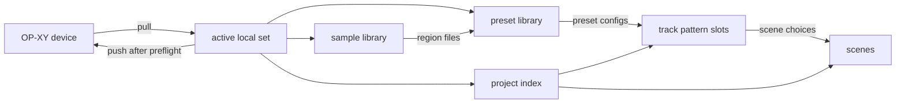
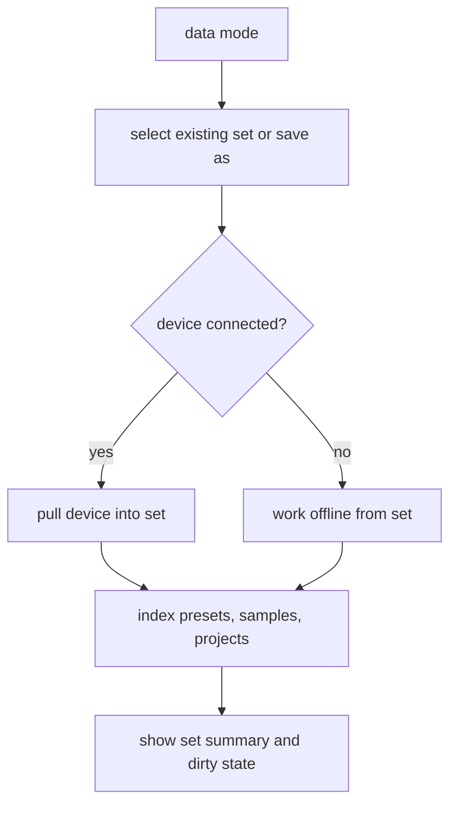
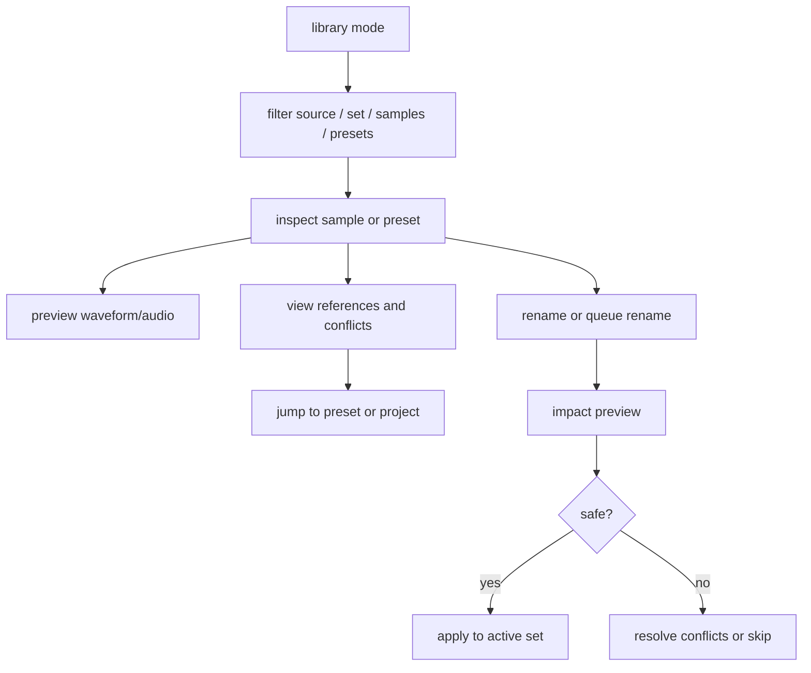
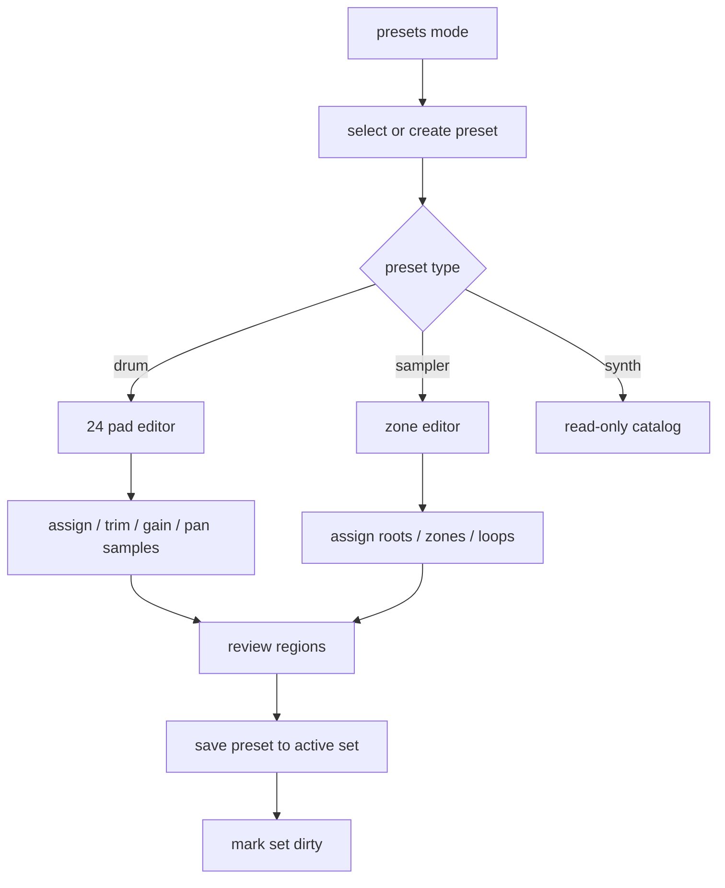
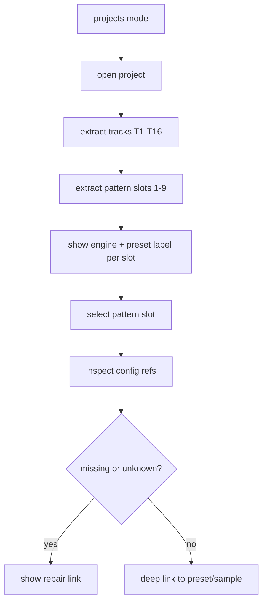
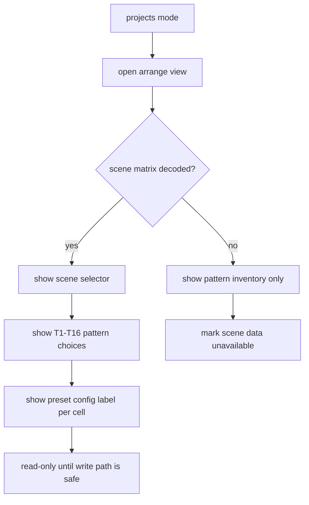
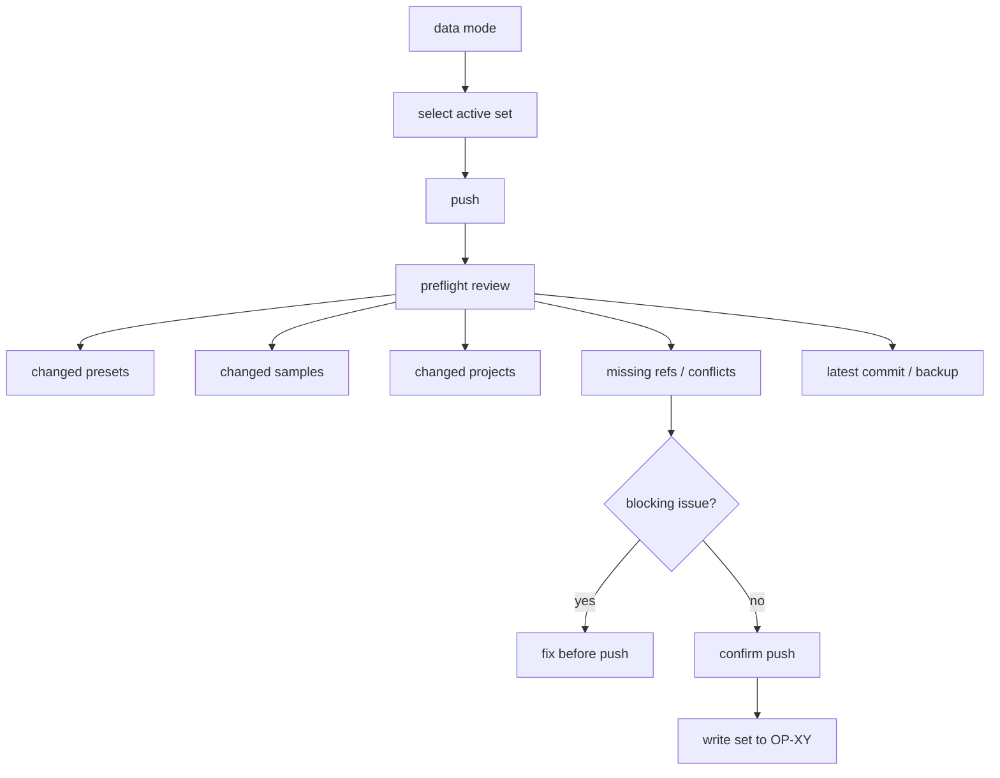

# UX Flow Map And Requirements Traceability

**Status:** Draft requirements-engineering companion  
**Parent:** [product-requirements-and-flows.md](./product-requirements-and-flows.md)  
**Related specs:** [mvp-screen-slices.md](./mvp-screen-slices.md), [product-decisions.md](./product-decisions.md), [data-tab-spec.md](./data-tab-spec.md), [projects-tab-spec.md](./projects-tab-spec.md), [presets-tab-spec.md](./presets-tab-spec.md), [samples-tab-spec.md](./samples-tab-spec.md)  
**Last updated:** 2026-06-08

---

## Purpose

This document connects product requirements to concrete application flows and implementation phases. It is meant to prevent the redesign from becoming a collection of nice screens without a shared operating model.

The north star is:

```text
local sets reduce OP-XY clutter
sample stewardship keeps the library clean
presets turn samples into playable configs
projects place preset configs into pattern slots
scenes arrange those pattern configs
push sends one curated set to the device
```

---

## System Map



### Read This As Product Logic

- The **device** is an endpoint, not the workspace.
- The **active set** is the workspace.
- **Samples** and **presets** are library objects.
- **Projects** consume library objects.
- **Pattern slots** are configuration containers.
- **Scenes** choose pattern slots per track.

---

## Mode Responsibility Matrix

| Mode | Owns | Must not own | Primary proof of value |
|------|------|--------------|------------------------|
| Data | Device connection, pull, push, set selection, set history | Preset editing, sample cleanup details, project arrangement editing | User understands what will move between device and active set |
| Samples | Sample search, inspection, cleanup, rename queue, sample refs | Preset region layout as primary view | User can clean names and understand usage risk |
| Presets | Preset catalog, regions, drum/sampler editors, synth catalog | Device push, note sequencing | User can build playable configs from samples |
| Projects | Project index, track pattern configs, scene arrangement, reference repair | Note editing, free-form song authoring | User can see which preset configs are used where |

---

## Flow Map

### 1. Create Or Select A Set



Trace:

| Requirement IDs | UI surfaces | Data needed |
|-----------------|-------------|-------------|
| SET-1, SET-2, SET-3, SET-5, SET-6, SET-7 | Sets mode, status strip, set carousel/history | Set manifest, local file index, device connection state |

### 2. Maintain Library Assets



Trace:

| Requirement IDs | UI surfaces | Data needed |
|-----------------|-------------|-------------|
| LIB-1, LIB-2, LIB-3, LIB-4, SMP-1, SMP-2, SMP-3, SMP-4, SMP-5, SAFE-1, SAFE-4 | Library list, asset inspector, staging queue, rename queue, impact slab | Source sample index, source preset index, preset region refs, project refs, audio metadata |

### 3. Build A Drum Kit Or Sampler Preset



Trace:

| Requirement IDs | UI surfaces | Data needed |
|-----------------|-------------|-------------|
| PRE-1, PRE-2, PRE-3, PRE-4, PRE-5, PRE-6, PRE-7, PRE-8, SAFE-3 | Presets list, preset detail, regions submode, edit submode | Patch JSON, audio files, region model, dirty state |

### 4. Inspect Pattern Configs In A Project



Trace:

| Requirement IDs | UI surfaces | Data needed |
|-----------------|-------------|-------------|
| PAT-1, PAT-2, PAT-3, PAT-4, PAT-5, PAT-6, SAFE-4, SAFE-5 | Projects list, project detail, pattern inventory, reference panel | `.xy` pattern index, engine map, preset-name scanner, sample refs |

### 5. Inspect Scene Arrangement



Trace:

| Requirement IDs | UI surfaces | Data needed |
|-----------------|-------------|-------------|
| SCN-1, SCN-2, SCN-3, SCN-4, SCN-5, SAFE-5 | Project arrange view, scene selector, track grid | Scene matrix parser, pattern index, format confidence status |

### 6. Push Curated Set To Device



Trace:

| Requirement IDs | UI surfaces | Data needed |
|-----------------|-------------|-------------|
| SET-4, SET-7, SET-8, SAFE-1, SAFE-2, SAFE-3 | Data mode, push preflight, change review | Dirty index, rename impact, missing refs, set history |

---

## Requirements Traceability Table

| Epic | Requirements | Primary Mode | First Implementation Slice |
|------|--------------|--------------|----------------------------|
| Set workspace | SET-1 through SET-8 | Data | Real set manifest + active set status strip |
| Sample stewardship | SMP-1 through SMP-7, SAFE-1, SAFE-4 | Samples | Unified sample index with refs and rename queue stub |
| Preset assembly | PRE-1 through PRE-8, SAFE-3 | Presets | Preset list/detail with embedded drum/sampler editors |
| Pattern config inspection | PAT-1 through PAT-6, SAFE-5 | Projects | Read-only pattern inventory from `.xy` extraction |
| Scene arrangement | SCN-1 through SCN-5, SAFE-5 | Projects | Scene placeholder + pattern grid; real scene matrix later |
| Push confidence | SET-4, SET-8, SAFE-1 through SAFE-3 | Data | Push preflight fed by dirty/ref indexes |

---

The implementation-facing version of this table lives in [mvp-screen-slices.md](./mvp-screen-slices.md). Use that document when deciding what belongs on each first-pass screen and what should be deferred.

## Phased Delivery Plan

### Phase 0 - Requirements And Flow Lock

Goal: make the product model testable before more UI is built.

- Product requirements doc exists.
- Flow map exists.
- Requirement IDs are stable enough to reference in issues/PRs.
- Existing mode specs link back to requirements.

Exit criteria:

- A future PR can say which requirement IDs it advances.
- Ambiguous terms like `pattern` and `set` have agreed definitions.

### Phase 1 - Active Set As Workspace

Goal: make set identity visible everywhere.

- Status strip shows active set.
- Data mode separates OP-XY pane from set pane.
- Existing editors save to active set language, not device language.
- Push remains a separate action.

Requirements covered:

- SET-1, SET-2, SET-7, SAFE-3.

### Phase 2 - Sample And Preset Indexes

Goal: make the library inspectable.

- Samples mode has real unified index.
- Presets mode includes synth read-only catalog.
- Preset regions link to sample detail.
- Sample detail links back to presets/projects.

Requirements covered:

- SMP-1 through SMP-7.
- PRE-1, PRE-2, PRE-5.
- SAFE-4.

### Phase 3 - Embedded Preset Editing

Goal: remove drum/multisample as top-level mental modes.

- Drum edit and sampler edit live under preset detail.
- Save/update writes active set.
- Region review is a first-class submode.

Requirements covered:

- PRE-3, PRE-4, PRE-6, PRE-7, PRE-8.

### Phase 4 - Project Pattern Config Index

Goal: inspect project usage without note editing.

- Projects mode extracts track/pattern inventory.
- Pattern cells show engine and preset label when known.
- Note count is metadata only.
- Missing refs link out to samples/presets.

Requirements covered:

- PAT-1 through PAT-6.
- SAFE-4, SAFE-5.

### Phase 5 - Scene Matrix

Goal: represent arrangement as scene-to-pattern-config choices.

- Scene selector appears when scene matrix is decoded.
- T1-T16 grid shows chosen pattern slot and config label.
- Undecoded projects show honest read-only unavailable state.

Requirements covered:

- SCN-1 through SCN-5.
- SAFE-5.

### Phase 6 - Push Preflight And Rename Safety

Goal: make device writes boring and trustworthy.

- Push preflight summarizes changes and risks.
- Rename queue uses impact preview.
- Blocking conflicts require resolution before push.

Requirements covered:

- SET-4, SET-8.
- SAFE-1 through SAFE-3.

---

## Decision Log Seeds

These need explicit decisions before implementation hardens:

| Decision | Options | Current Lean |
|----------|---------|--------------|
| Project ownership | Projects belong to one set vs shared project pool | Belong to active set for simpler push semantics |
| Push model | Full tree replace vs changed files only | Preflight should support both; implementation can start changed-only |
| Scene editing | Read-only until parser/writer confidence vs local planning-only mock | Read-only first |
| Pattern config assignment | Expose before write path vs hide until writable | Inspect first, assign later |
| Sample rename suffix | Preserve device `{note}-{idx}` vs rewrite whole filename | Preserve by default; allow advanced rename later |

---

## Review Checklist For Future UI Work

Before accepting a screen or feature:

- [ ] It states the active set or inherits it visibly from the shell.
- [ ] It does not imply direct device mutation unless in data push/pull flow.
- [ ] It distinguishes samples, presets, pattern slots, and scenes.
- [ ] It avoids note-editing affordances in project pattern workflows.
- [ ] It has an answer for missing refs or unsupported format areas.
- [ ] It names the requirement IDs it satisfies.
- [ ] It has a safe empty/offline/error state.
